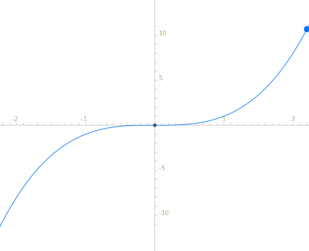

# 凸优化

$$x_1 +2x_2=0$$
$$2x_1+x_2=1$$
$$3x_1+2x_2=1$$
$$b \notin C(A)$$

求近似解：
$$min_{x_1,x_2}=(x_1+2x_2-0)^2+(2x_1+x_2-1)^2+(3x_1+2x_2-1)^2$$

可以解得最小值为0.038
## 导数

###一阶导数和梯度
$$f^{'}(x)$$

$$\triangledown f(x)=\left [ \frac{\partial f(x)}{\partial x_1}\right ]$$
###二阶导数和Hessian矩阵
$$f^{''}(x)$$

$$H(x)=\triangledown ^{2} f(x) =\left[ \begin{matrix}    \frac{\partial ^{2} f(x)}{\partial x_1^{2}} & \frac{\partial ^{2} f(x)}{\partial x_1 x_2} & \dots & \frac{\partial ^{2} f(x)}{\partial x_1 x_n} \\
\frac{\partial ^{2} f(x)}{\partial x_2 x_1} & \frac{\partial ^{2} f(x)}{\partial x_2^{2}} & \dots & \frac{\partial ^{2} f(x)}{\partial x_2 x_n} \\
\dots &\dots &\dots &\dots \\
\frac{\partial ^{2} f(x)}{\partial x_1^{2}} & \frac{\partial ^{2} f(x)}{\partial x_1 x_2} & \dots & \frac{\partial ^{2} f(x)}{\partial x_n ^{2}} \end{matrix} \right]$$

| 数学名词 | 符号 | 解析 |
| -- | :--: | -- |
| 半正定 | $$\succeq$$  | 特征值大于等于0 |
| 正定 | $$\succ$$ | 特征值大于0 |
| 负定 | $$\prec$$ | 特征值小于0 |
|定 | 无 | 特征值有正有负 |

Hessian矩阵
##泰勒展开
**标量泰勒展开式**

$$f(x_k+\delta)\approx f(x_k)+f^{'}(x_k)\delta +\frac{f^{''}(x_k)}{2}\delta^{2} \tag{1}$$

**矢量泰勒展开式**

$$f(x_k+\delta)\approx f(x_k)+\triangledown ^{T} f(x_k)\delta+\frac{1}{2}\delta^{T} \triangledown^{2}f(x_k)\delta \tag{2}$$

##梯度下降
梯度下降只考虑一阶导数，即：$$f(x_k+\delta)\approx f(x_k)+\triangledown ^{T} f(x_k)\delta$$

$$\triangledown ^{T} f(x_k)\cdot\delta为两个向量作内积，即\left| \triangledown ^{T} f(x_k) \right| \times \left | \delta \right| \times cos\alpha,\alpha 为两个向量夹角，cos\alpha \in \left [-1,1\right ]$$,当两个向量处于同一条直线时，变化最大，又因$$f(x)$$$$减小，即$$$$d_k = - \triangledown f(x_k)$$
##牛顿法

| 英文单词 | 中文解释 |
| :-- | -- |
| 0:2 | 1:2 |

